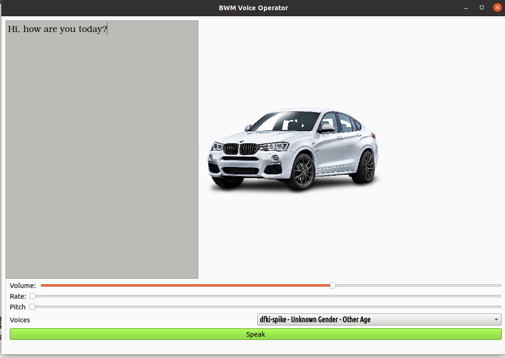

# QT6.5 Desktop Development for BMW Voice Operator

Here I used QT Speech To Text API and QT MainWindow UI to develop Desktop
for Automative cars

1. MainWindows UI
2. Qt Vectors
3. Qt String
4. Qt Voices
5. QT Speech To Text

